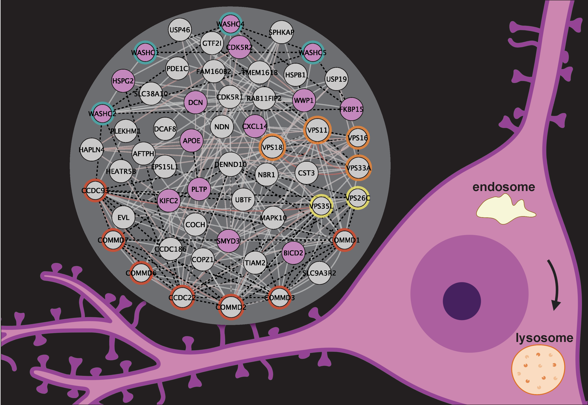

# SwipProteomics

This repository is an archive of the proteomics [data](./data/README.md) and
source [code](./analysis/README.md) used in the analyses by 
[Courtland _et al._, 2021](./docs/SWIP-eLife-paper.pdf).

Please see
[soderling-lab/SwipProteomics](https://github.com/soderling-lab/SwipProteomics)
for an extant version of this code.



## Usage Example

```R 
# download the repository as an R package
devtools::install_github("soderling-lab/SwipProteomics")

library(dplyr)
library(SwipProteomics)

# load the normalized data
data(swip_tmt)

# washc4's uniprot ID
data(swip)

# fit a model
fx <- log2(Intensity) ~ 0 + Condition + (1|Mixture)
fm <- lmerTest::lmer(fx,data=swip_tmt %>% subset(Protein==swip))

# create a contrast
LT <- getContrast(fm,"Mutant","Control")

# assess contrast 
res <- lmerTestContrast(fm, LT) %>% mutate(Contrast='Mutant-Control') %>% unique()

knitr::kable(res)

```

|Contrast       |    log2FC| percentControl|        SE| Tstatistic| Pvalue| DF|       S2|isSingular |
|:--------------|---------:|--------------:|---------:|----------:|------:|--:|--------:|:----------|
|Mutant-Control | -1.401866|      0.3784393| 0.0264791|  -52.94235|      0| 28| 0.007362|TRUE       |

lmerTestContrast returns a data.frame with statistics from the model-based
contrast. The column `isSingular=TRUE` in this case indicates that the variance
attributes to `Mixture` is negligible. 


```R

## fit WASH Complex

library(dplyr)
library(SwipProteomics)

data(washc_prots)

# module-level model includes ranef Protein
fx1 <- log2(rel_Intensity) ~ 0 + Condition + (1|Protein)

# fit the model
fm1 <- lmerTest::lmer(fx1, data = swip_tmt %>% subset(Protein %in% washc_prots))

# assess overall 'Mutant-Control' comparison
res1 <- lmerTestContrast(fm1, LT) %>% mutate(Contrast='Mutant-Control') %>% unique()

knitr::kable(res)

```

|Contrast       |    log2FC| percentControl|        SE| Tstatistic| Pvalue|  DF|        S2|isSingular |
|:--------------|---------:|--------------:|---------:|----------:|------:|---:|---------:|:----------|
|Mutant-Control | -1.379633|      0.3843165| 0.0392109|  -35.18497|      0| 151| 0.0645747|FALSE      |
