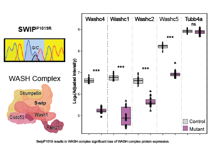

# SwipProteomics

Analysis of Swip (Washc4) mutant mouse brain spatial proteomics

## Swip R1019R Mutation

  

The Swip (Washc4) protein.

  

# FIXME:
* Save network PPI information.
* module_noa and module_stats are potentially redundant
* column names of module_noa changed and may cause bugs
* adjusted protein boxplots -- some  of 968 are annotated as NS?
* Insure consistent use of BF p-adjust for higher level stats.

