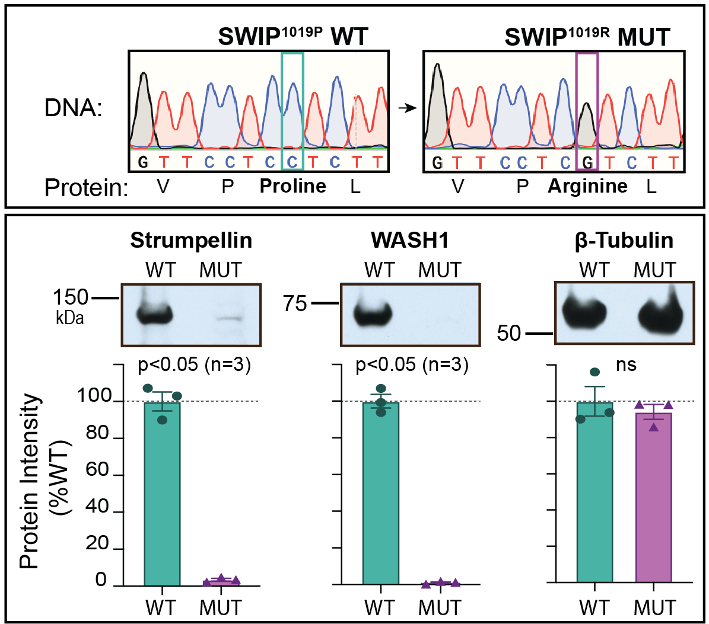
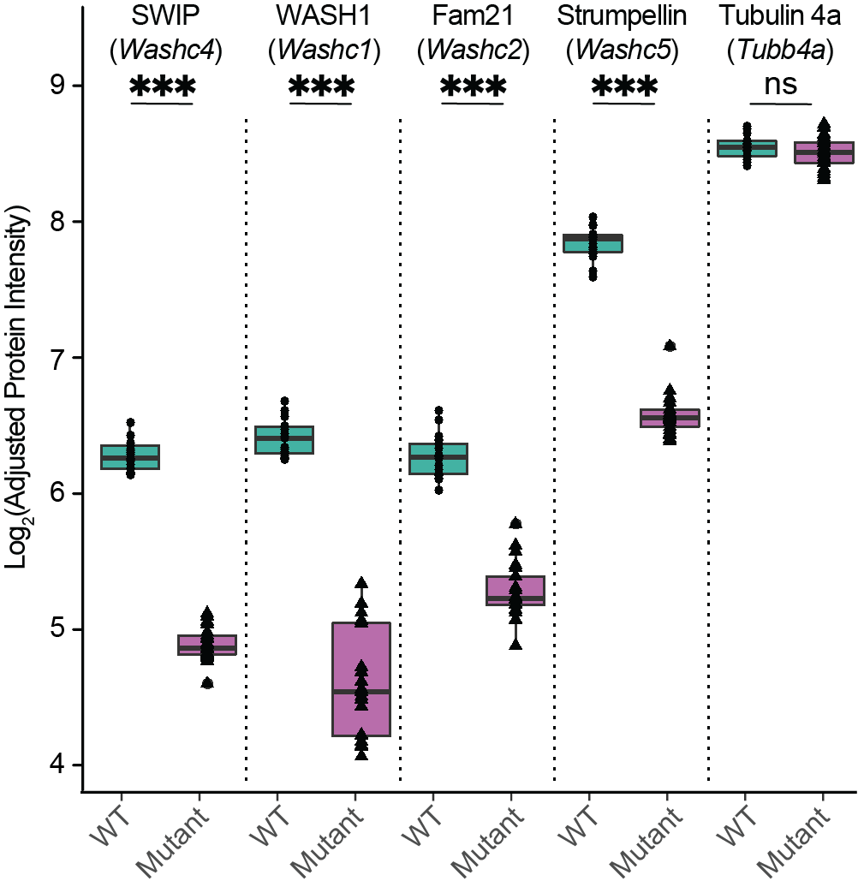

# SwipProteomics
This repository contains the data and source code associated with [Courtland _et al._, 2020](manuscript/nat-neuro/main/SWIP_paper_JC_v25.pdf).
This includes the:
* Analysis of  __WASH iBioID__ Proteomics
* Analysis of __SWIP<sup>P1019R</sup> 16-plex TMT__ Spatial Proteomics

### The WASH complex member SWIP: an intellectual disability gene
__Ropers _et al.___ [1] identified a non-synonymous mutation in the __WASHC4__ gene of
seven children with intellectual impairment, learning and social deficits, and delayed motor development. 
This genetic mutation causes a __P1019R__ amino acid substitution in SWIP,
a *S*trumpellin and <u>W</u>ASH <u>I</u>nteracting <u>P</u>rotein and component of the pentameric __WASH complex__.
SWIP P1019R results in decreased SWIP and destabilizes the WASH complex. 
Below is the WASH complex as well as a model of SWIP's predicted 3D structure with the 
position of the P1019R amino acid substitution highlighted in red.

| __WASH Complex__ | __SWIP<sup>P1019R</sup>__ |
|------------------|---------------------------|
|||

### Genetic Disruption of WASHC4
To study SWIP<sup>P1019R</sup>, a point mutation was made in the 
mouse Washc4 gene using CRISPR genome editing. SWIP<sup>P1019R</sup> causes a
drastic decrease in the abundance of __Strumpellin__ and __WASH1__ protein in
the brains of mice. These data suggest that the entire WASH complex is
destabilized in the presence of SWIP<sup>P1019R</sup>.

<p align="center">
  
  </p>

### Endo-lysosome Network Dysfunction in SWIP<sup>P1019R</sup> Brain
Using 16-plex TMT-proteomics we quantified __5,894__ proteins from 
__7__ subcellular fractions prepared from WT control and SWIP<sup>P1019R</sup> MUT mice.

We observed a significant reduction in the abundance of WASH complex proteins
__SWIP__, __WASH1__, __Fam21__, and __Strumpellin__. These data confirm that the 
entire WASH complex* is dysrupted in the presence of SWIP<sup>P1019R<\sup>.

<p align="center">
  
  </p>

## METHODS
#### Spatial proteomics

#### Network construction
I built a protein covariation matrix using the `bicor` 
[(rdocumentation)](https://www.rdocumentation.org/packages/WGCNA/versions/1.69/topics/bicor) 
function, a robust alternative to Pearson's coorelation.

To remove noise from the graph, I used network enhancment [3].
My `neten` code [(github)](https://github.com/twesleyb/neten) was forked from an R port [(github.com/microbma/neten)](https://github.com/microbma/neten) 
of the original Matlab code [(github.com/wangboyunze/Network_Enhancement)](https://github.com/wangboyunze/Network_Enhancement).

## Community Detection
Modules were identified in the enhanced protein covaration graph using the `leiden algorithm` [(github)](https://github.com/vtraag/leidenalg)[4].
 We utilized the [Surprise](refs/Traag_2015.pdf) quality metric to optimize clustering.

* [NetRep](https://cran.r-project.org/web/packages/NetRep/vignettes/NetRep.html) and original paper [Ritchie _et al._, 2016](refs/Ritchie_2016.pdf). 

## Differential protein and Module Abundance
* [edgeR](https://bioconductor.org/packages/release/bioc/html/edgeR.html) used
    to model proteins and modules and test for differential abundance between WT
    and SWIP MUT mice.

## Misc
* Remove mitochondrial contaiminants [geneLists](https://github.com/twesleyb/geneLists).
* Interactions among WASH interactome as well as SWIP TMT proteome compiled using [getPPIs](https://github.com/twesleyb/getPPIs) 
  which currates PPIs from the [HitPredict](http://www.hitpredict.org/) database.
* [Colors](https://github.com/kevinwuhoo/randomcolor-py) installed with [conda](https://anaconda.org/conda-forge/randomcolor).


## Results 
We show that this point mutation disrupts expression of the
WASH complex in the brain and results in empaired endosomal trafficking in
neurons. Mice exhibit impaired cognition and motor deficites as well as cellular 
biomarkers of neurodegeneration. 

## Explore
To explore the data, download or install this repository as an R package.

```Bash
# Clone the repository.
git clone twesleyb/SwipProteomics
```

```R
# Download as an R package.
devtools::install_github('twesleyb/SwipProteomics')
```

```R
# Load the data.
devtools::load_all()
data(tmt_proteomics) # the final normalized TMT data
data(partition) # the partition of the protein covariation graph
```

## Reproducibility 
Effort was made to make the analysis as reproducible as possible. Reproduce the
R environment used to perform that analysis using [conda](https://docs.anaconda.com/anaconda/install/) 
and [renv](https://anaconda.org/conda-forge/r-renv). 
Install all additional Python dependencies with conda (e.g. [Leidenalg](https://anaconda.org/conda-forge/leidenalg)). 
Install all additional R dependencies with [renv](https://github.com/rstudio/renv). 
The conda environment can reproduced from the `SwipProteomics.yml` file.
The renv environment can reproduced from `renv.lock` file.

## References
[1] [Ropers _et al._, 2011](refs/Ropers_2011.pdf)  
[2] [Geladaki _et al._, 2019](refs/Geladaki_2019.pdf)  
[3] [Wang _et al._, 2018](refs/Wang_2018.pdf)  
[4] [Traag _et al._, 2019](refs/Traag_2019.pdf)  
