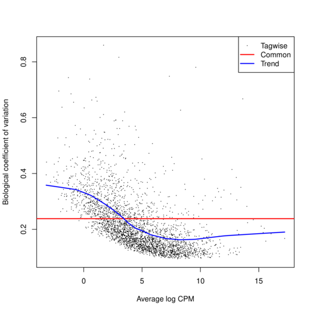
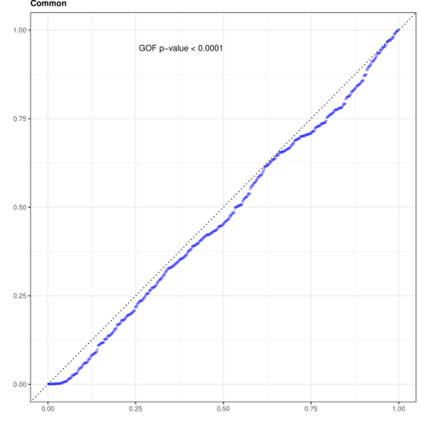
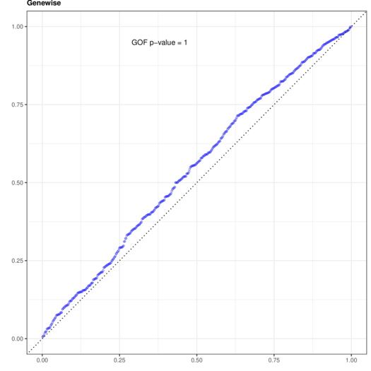
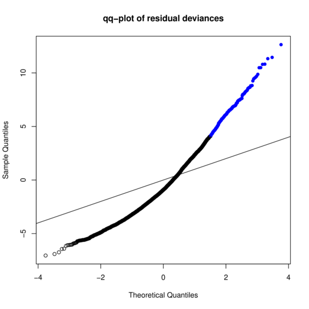
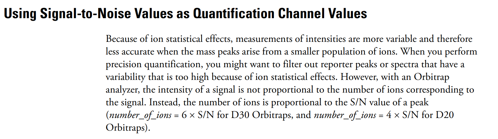

# Datafeast October 1st, 2020

* The negative `binomial model` is not appropriate for TMT MS data.

* The module-level analysis is better fit by a `mixed-effects linear model`.

## Goodness-of-fit
The NBGOF package was forked from [gu-mi](https://github.com/gu-mi/NBGOF). 

Goodness-of-fit was assessed for three dispersion methods: `Common`, `Trended`,
and `Genewise` dispersion. 

__NOTE:__ only the `Common` and `Trended` dispersions are
appropriate for edgeR's glm functions.

<p align="center"> 
  
  </p>


```
Simulating Common dispersion model.
--------------------------------------------------------------- 
| Data simulated/used: 
| NB model used: Common 
| Simulation size: 999 
| Count matrix dimension: 500 x 3 
| Fisher Method GOF p-value (Vert.Dist.(1s)) = 0.0004504835 
| Fisher Method GOF p-value (Pear.Stat.(1s)) = 0.3005015 
-------------------------------------------------------------- 
```
`P < 0.05` indicates a significant difference between our data and the NB
distribution using the `Common` dispersion metric.

<p align="center"> 
  
  </p>

```
Simulating Trended dispersion model.
--------------------------------------------------------------- 
| Data simulated/used: 
| NB model used: Trended 
| Simulation size: 999 
| Count matrix dimension: 500 x 3 
| Fisher Method GOF p-value (Vert.Dist.(1s)) = 0.09539997 
| Fisher Method GOF p-value (Pear.Stat.(1s)) = 0.8656591 
-------------------------------------------------------------- 
```

`P < 0.01` suggests a significant difference between our data and the NB
distribution using the `Trended` dispersion metric.

<p align="center"> 
  
  </p>

```
Simulating Genewise dispersion model.
--------------------------------------------------------------- 
| Data simulated/used: 
| NB model used: Genewise 
| Simulation size: 999 
| Count matrix dimension: 500 x 3 
| Fisher Method GOF p-value (Vert.Dist.(1s)) = 0.9999934 
| Fisher Method GOF p-value (Pear.Stat.(1s)) = 0.2777018 
-------------------------------------------------------------- 
```
`P > 0.9` suggests no significant difference between our data and the NB
distribution using the `Genewise` aka `Tagwise` dispersion metric.

<p align="center"></p>

## Alternative approach 
EdgeR includes a function `gof` to asses the goodness-of-fit of protein-wise
models!
<p align="center"></p>

<div align="center">

__Figure 1__. The goodness-of-fit of protein-wise generalized linear models fit by `edgeR::glmQLFit`. 

  </div>

## Analysis with DEP

Spearman rank coorelation of edgeR and DEP pvalues ~ 0.9 for intrafraction
comparisons.

<p align="center"></p>


## Analysis with MSstats and MSstatsTMT

### What input?
<p align="center"></p>


Analyzing the tutorial data included with `MSstatsTMT`.

<p align="center"></p>
