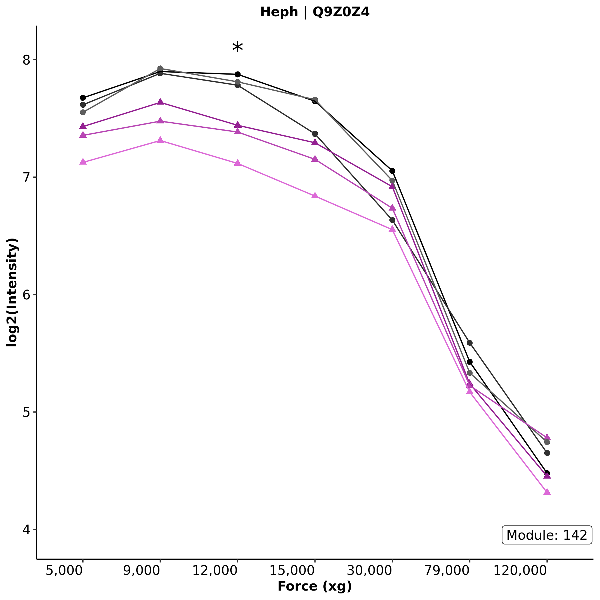

# Supplementary File 4

Plots of protein abundance measured in seven subcellular fractions for __85__
proteins with an intrafraction significant difference between WT and MUT groups (FDR < 0.1). 
The 7 subcellular fractions coorespond to fractions 4-10 in Geledaki _et al._, 2019 [37].

#### Example Plot:

#### Plot Attributes:
| Attribute | Description |
| --------- | ----------- |
| _x-axis_   | Centrifugal force (xg) used to obtain the cooresponding subcellular fraction.|
| _y-axis_   | Log2(Normalized Protein Intensity) |
| _point shape_   | Circles and triangles indicate animal genotype, WT and MUT, respectively. |
| _line color_   | Lines connecting points are colored according to biological replicate. |

#### Statistical Significance:
| Symbol | Threshold |
|--------|-----------|
| . | FDR < 0.1   |
| * | FDR < 0.05  |
| **| FDR < 0.005 |
|***| FDR < 0.0005|
