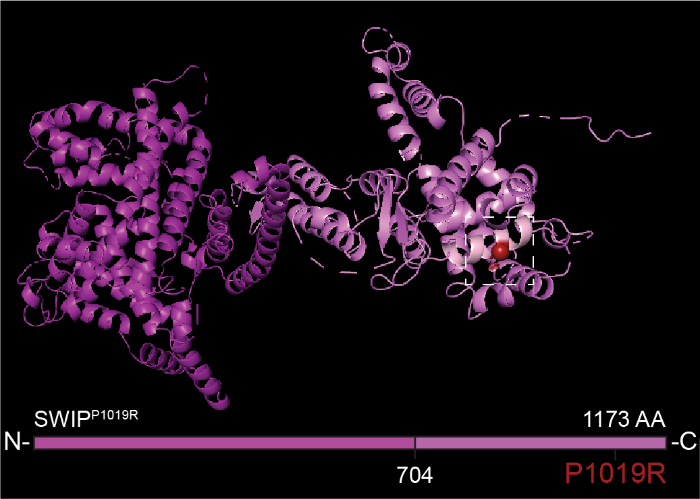

# SWIP Predicted Protein Structure

* Swip_1019PR.pse - Pymol file containing a model of the SWIP mutant protein.
* Swip_P1019R.pdb - PDB file containing a model of the SWIP mutant protein.
* Swip_WT.pdb - Universal pdb file with a modeel of the SWIP protein.
* Swip_WT.pse - PyMol file with model of the SWIP protein.
* hWASHC4.prot - SnapGene file with map of the human WASHC4 protein.
* mWASHC4.prot - SnapGene file with map of the mouse WASHC4 protein.

A structure of the SWIP protein was generated using [Phyre]().
The SWIP protein has no recognizable domains, but is highly helical. 
SWIP interacts directly with Strumpellin, probably through its C-terminus (Jia
et al., Figure S5).

<p align='center'>
    
    </p>

In pymol, generate a gif of the SWIP protein can be generated using the following commands:
```
# Generate a gif.
mset 1,180 
util.mroll 1, 180, 1
set ray_trace_frames, 1 
set cache_frames, 0

# Save as a video: File > save as video > PNG images
# The image stack was made into a gif with the img2gif shell script.

```

The full use of Pymol without a liscense is restricted.
A better alternative to pymol is chimera. Convert `protein.pse` (pymol specific format) 
to the univeral .pdb format and create a video in chimera.

```
# Convert the video to a stack  of images.
ffmpeg -i infile.avi -f image2 image-%03d.jpg

# Convert the images to a gif.
img2gif JPG/ 1 -1 wt.gif
```
